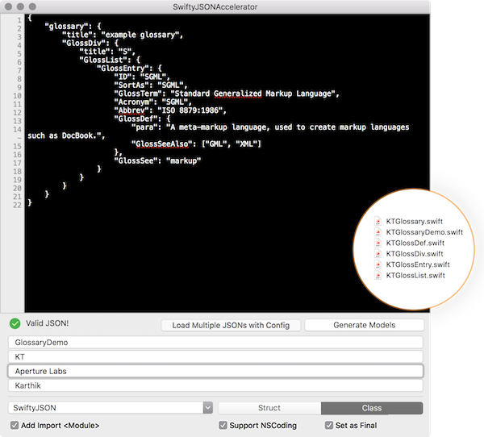

# SwiftyJSONAccelerator

 

**Version v1.0.0 Released!**

- Now generates **Swift 3** and the software itself is upgraded to Swift 3.
- Unit tests and complete code coverage for file generation module.
- Modular code to make adding support for other JSON mapping libraries simple.
- Project upgraded with SwiftLint, Travis, CocoaPods etc.

## Download/Installing
- Download the repo, install pods and run the project!
- [Download the .app(v1.0.0)](https://github.com/insanoid/SwiftyJSONAccelerator/releases/download/v1.0.0/SwiftyJSONAccelerator.zip)

A swift model generator like the Objective-C [JSONAccelerator](http://nerdery.com/json-accelerator). Formats and generates models for the given JSON and also breaks them into files making it easy to manage and share between several models.

The models that are generated depend on JSON object mapping libraries, currently the model can be generated to depend on any of the below mentioned mapping libraries:

- [SwiftyJSON](https://github.com/SwiftyJSON/SwiftyJSON)
- [Hearst-DD/ObjectMapper](https://github.com/Hearst-DD/ObjectMapper)

Currently, the pattern is very similar to its Objective-C counterpart. It generates classes with following properties.

- Initalize with `JSON` (SwiftyJSON or ObjectMapper) or Initalize with `Any`
- Optional `NSCoding` compliance.
- Convert object to `Dictionary` for description printing.

- Simple configurable interface for generation of file.
- Each class in the JSON is generated as a file.

## Adding New Libraries

- Add a new type in `JSONMappingLibrary` in [Constants.swift](SwiftyJSONAccelerator/Constants.swift).
- Follow the examples in [Library-Extensions](SwiftyJSONAccelerator/Library-Extensions) and create a struct implementing`ModelFile`. Follow the other extensions for SwiftyJSON and ObjectMapper, they tell you what all you can replace based on your libraries specification.
- Do the necessary UI changes for the dropdown.
- Add tests for your library.

## Swift 2?

[Download (v0.0.6)](https://github.com/insanoid/SwiftyJSONAccelerator/releases/download/v0.0.6/SwiftyJSONAccelerator.zip), the older version of the project, please keep in mind it is **no longer supported**.

## Todo

There is a lot more to do, follow the [issues section](https://github.com/insanoid/SwiftyJSONAccelerator/issues), I usually try to follow up or keep the list updated with any new ideas which I plan to implement.

- Build a CLI, useful in integrated with mocks and API documentations.
- Creating a better UI for the application.
- Adding support for better libraries mentioned [here](https://github.com/bwhiteley/JSONShootout).

## Contributions and Requests

Any suggestions regarding code quality of the app, generated code's quality, Swift related improvements and pull requests are all very welcome. Please make sure you submit the pull request to the next release branch and not the master branch.

## License

[MIT License](LICENSE) / [Karthikeya Udupa](https://karthikeya.co.uk)
